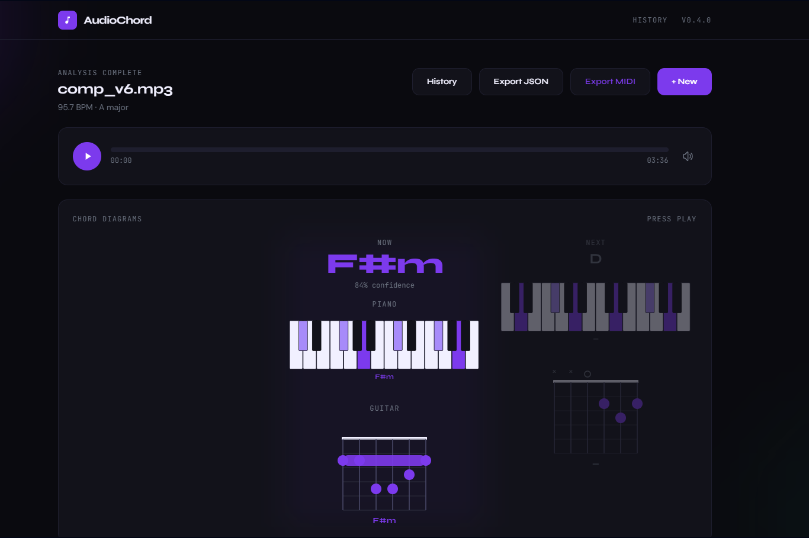
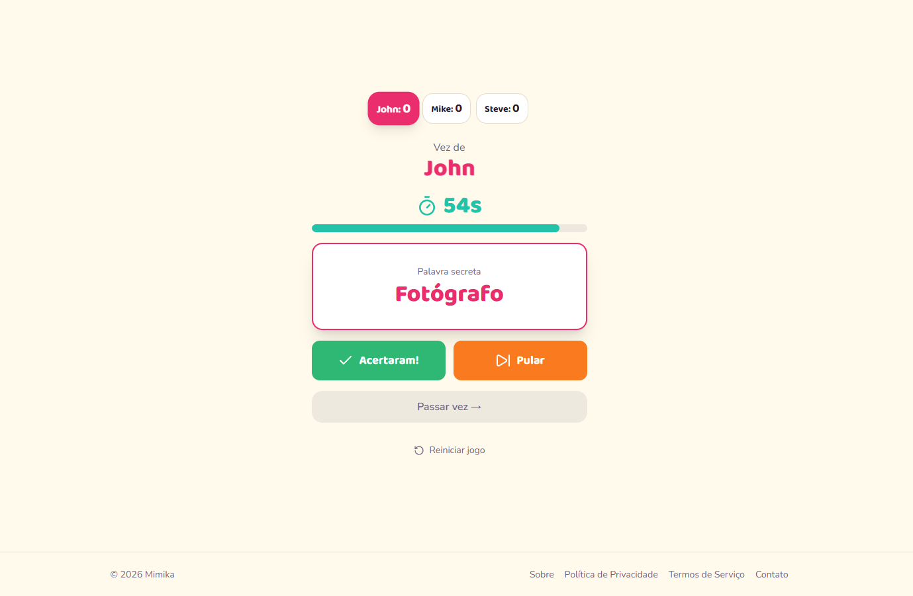
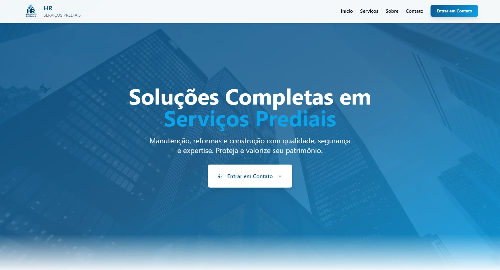

<h1 align="center">Hi, I'm Felipe Almeida</h1>

Senior Software Developer | 7+ years | Rio Claro, SP, Brazil

  
  
  

Senior software developer with 7+ years building web systems end to end — from architecture and database design to cloud deployment on Google Cloud Platform. Lately I specialize in **intelligent automation**, designing AI agent pipelines with LangChain and LangGraph that streamline real business workflows, on top of solid full stack fundamentals in Vue.js, Nuxt, React, and Ruby on Rails.

## What I bring

- **End-to-end ownership** — from requirements and architecture design to cloud infrastructure on GCP.
- **AI agent pipelines** — production-oriented automation with LangChain and LangGraph.
- **Full stack depth** — Vue.js, Nuxt, React, Next.js, Ruby on Rails, and Python across the stack.
- **Quality by default** — CI/CD pipelines with GitHub Actions, Playwright, and JIRA-driven workflows.
- **Team collaboration** — co-managing a 5-person cross-functional team under Scrum/Agile.

## Tech Stack

**Front end**

**Back end**

**AI / automation**

**Data & cloud**

**Tools & practices**

## Featured Projects

<table>
  <tr>
    <td width="320"></td>
    <td valign="top">
      <h3>AudioChord</h3>
      
Web app that analyzes an uploaded audio file, detects its chord progression automatically, and renders live piano and guitar diagrams in sync with playback. Includes MIDI export.

      

        
        
        
      

      

        <a href="https://audio2chords.netlify.app">Live demo</a> ·
        <a href="https://github.com/Felipe-A-Almeida/audio2chords">Source</a>
      

    </td>
  </tr>
  <tr>
    <td width="320"></td>
    <td valign="top">
      <h3>Mimika</h3>
      
Charades-style word-guessing party game for groups, with teams, a round timer, and a live scoreboard.

      

        
        
        
      

      

        <a href="https://mimika.com.br">Live demo</a> ·
        <a href="https://github.com/Felipe-A-Almeida/mimika">Source</a>
      

    </td>
  </tr>
  <tr>
    <td width="320"></td>
    <td valign="top">
      <h3>HR Serviços Prediais</h3>
      
Institutional site for a building maintenance, renovation, and construction company, focused on converting visitors into commercial contacts.

      

        
        
        
      

      

        <a href="https://hrservicosprediais.com.br">Live demo</a> ·
        <a href="https://github.com/Felipe-A-Almeida/hrservicosprediais">Source</a>
      

    </td>
  </tr>
</table>
